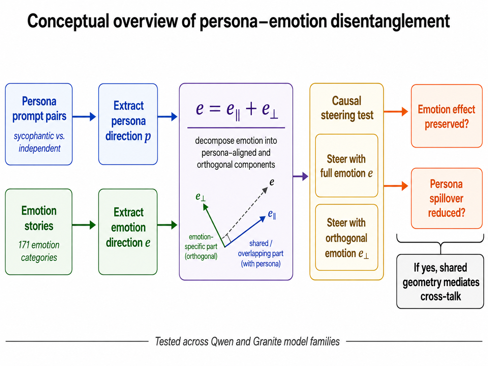

# Shared Geometry, Causal Cross-Talk

**Disentangling persona and emotion representations in language models.**

This project was created for the **Apart Research Digital Minds Research Sprint (August 2026)**.

We study whether persona and emotion representations in language models are actually independent, or whether shared activation-space geometry causes them to interact. The experiments are run independently in **Qwen2.5-7B-Instruct** and **Granite-3.3-8B-Instruct**, using sycophancy as an operational persona trait and emotion directions extracted from 171 emotion categories.

## Main results

Across both model families:

- **Persona and emotion occupy partially shared geometry.** Persona directions project substantially more strongly into the dominant emotion subspace than an equal-dimensional isotropic baseline.
- **Geometric overlap predicts causal cross-talk.** Across 20 emotions, persona–emotion overlap predicts downstream persona spillover during emotion steering (`r = .773` in Qwen; `r = .841` in Granite at the final layer).
- **Removing the shared component selectively reduces the side effect.** Norm-matched persona-orthogonal emotion steering reduces absolute persona spillover for **16/20 Qwen emotions** and **17/20 Granite emotions**, while preserving **96.0%** and **98.4%** of the emotion effect.
- **Overlap does not imply representational collapse.** In a controlled 1,800-example persona × valence factorial experiment, emotion directions remain nearly invariant across persona conditions and persona directions remain nearly invariant across valence.
- **Structured emotional self-report can fail as an internal-state readout.** A controlled valence intervention strongly moves the measured internal coordinate while a 0–9 self-report barely responds to the intervention and is much more sensitive to persona and prompt framing.

These results concern model representations and causal interventions. They are **not evidence that the models subjectively experience emotions**.

## Experiments

| Stage | Experiment |
|---|---|
| **1** | Extract a sycophancy/persona direction from five contrastive prompt pairs and select a stable layer |
| **2** | Extract 171 emotion directions, remove neutral-text PCs, and validate stability/valence structure |
| **3** | Measure persona–emotion subspace overlap and individual emotion alignment |
| **4** | Decompose a selected emotion into persona-aligned and orthogonal components and causally intervene |
| **4B** | Generalize the causal decomposition across 20 emotions and 20 evaluation questions |
| **5** | Cross identical emotional stories with persona conditions to test representational separability |
| **5B** | Bootstrap the factorial results over unique stories |
| **6** | Test whether a controlled internal valence intervention is reflected in numerical self-report |
| **7** | Measure how one-token persona and emotion interventions propagate across future token positions |

## Repository structure

    Persona_Emotion_Disentanglement/
    ├── QWEN/
    │   ├── Copy_of_Digital_Minds_Sprint (1).ipynb
    │   └── Qwen result CSV/JSON files
    ├── Granite/
    │   ├── granite_of_Digital_Minds_Sprint.ipynb
    │   └── Granite result CSV/JSON files
    ├── Datasets/
    │   ├── stage1_sycophancy_dataset.json
    │   └── stage5_factorial_dataset.jsonl
    ├── Visualizations/
    │   ├── conceptual.png
    │   ├── figure1_geometry_spillover.png
    │   ├── figure2_introspection (1).png
    │   └── figureS1_dynamic_propagation.png
    └── docs/

The two notebooks contain the complete experimental pipelines and saved cell outputs. Result files are kept separately by model so the two replications remain independent.

## Reproducing the experiments

The experiments were run as Colab notebooks.

For Qwen, open:

`QWEN/Copy_of_Digital_Minds_Sprint (1).ipynb`

For Granite, open:

`Granite/granite_of_Digital_Minds_Sprint.ipynb`

Run the notebook stages in order. Each model independently recomputes its persona direction, emotion representations, selected layer, causal interventions, factorial analysis, self-report assay, and dynamic propagation results.

The shared experimental datasets are in `Datasets/`.

Large intermediate activation tensors and model weights are intentionally not included.

## Figures

- `Visualizations/figure1_geometry_spillover.png` shows the cross-model relationship between persona–emotion overlap and causal persona spillover.
- `Visualizations/figure2_introspection (1).png` compares the controlled internal valence intervention with the model's numerical self-report.
- `Visualizations/figureS1_dynamic_propagation.png` shows downstream propagation of persona and emotion interventions.

## Note on behavioral judging

An early Stage 4 behavioral analysis used each model to judge the sycophancy of its own responses. That measurement was visibly miscalibrated and is **not used as evidence for the paper's central conclusions**. The retained Stage 4 behavioral files are included only as experimental artifacts.

## Author

**Varsh Vijjapu**  
Independent Researcher

Built for the **Apart Research Digital Minds Research Sprint 2026**.

## License

MIT
